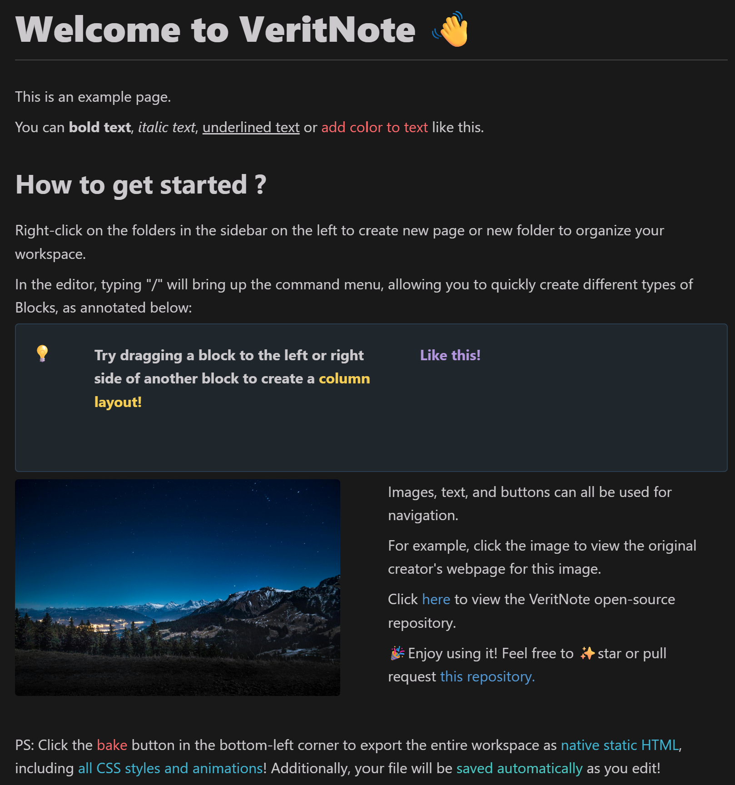

# VeritNote

## A Notion-like software that fully supports localization and can render in native HTML and CSS stylesheets!

## Create cool things like this :

## Dependencies

This project uses the following third-party libraries:

* [**nlohmann/json**](https://github.com/nlohmann/json): Licensed under the **MIT License**.
* [**WIL**](https://github.com/microsoft/wil): Licensed under the **MIT License**.
* [**WebView2 SDK**](https://developer.microsoft.com/en-us/microsoft-edge/webview2)

Copyright(c) 2025 the respective authors
All rights reserved.